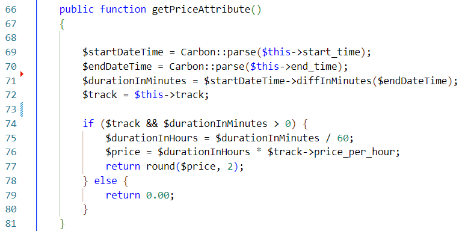

# Aplikacja do Zarządzania Klubem Strzeleckim

## Spis treści

  
Pokaż / Ukryj

- [Wprowadzenie](#wprowadzenie)
- [Projekt GUI](#projekt-gui)
  - [Widok rezerwacji dla użytkowników](#widok-rezerwacji-dla-użytkowników)
  - [Widok torów strzeleckich dla niezarejestrowanych użytkowników](#widok-torów-strzeleckich-dla-niezarejestrowanych-użytkowników)
  - [Widok profilu użytkownika](#widok-profilu-użytkownika)
  - [Widok logowania](#widok-logowania)
- [Baza Danych](#baza-danych)
  - [Schemat ERD](#schemat-erd)
  - [Połączenie z Bazą Danych](#połączenie-z-bazą-danych)
- [Relacje Modeli](#relacje-modeli)
  - [Model Użytkownika](#model-użytkownika)
  - [Model Toru Strzeleckiego](#model-toru-strzeleckiego)
  - [Model Roli](#model-rol)
  - [Model Rezerwacji](#model-rezerwacji)
- [Narzędzia i Technologie](#narzędzia-i-technologie)
- [Konfiguracja Aplikacji](#konfiguracja-aplikacji)
- [Uruchomienie Aplikacji](#uruchomienie-aplikacji)
- [Funkcjonalności Aplikacji](#funkcjonalności-aplikacji)
- [CRUD](#crud)
  - [Panel admina](#panel-admina)
  - [Panel torów strzeleckich](#panel-torów-strzeleckich)
  - [Panel klubowiczy](#panel-klubowiczy)
- [Logika biznesowa](#logika-biznesowa)
- [Licencja](#licencja)

## Wprowadzenie

Projekt został stworzony z myślą o efektywnym zarządzaniu strzelnicą w klub strzelecki. Kluby strzeleckie to miejsca, gdzie entuzjaści strzelectwa spotykają się, aby trenować, rywalizować i doskonalić swoje umiejętności strzeleckie. Organizują oni treningi, zawody oraz zajmują się zarządzaniem członkami klubu, sprzętem strzeleckim i innymi aspektami związanymi z prowadzeniem klubu. Aplikacja oferuje funkcjonalności ułatwiające organizację klubu, takie jak zarządzanie torem strzeleckim, rezerwacjami oraz członkami klubu. Użytkownicy mają możliwość dokonywania rezerwacji torów strzeleckich, a administrator ma pełną kontrolę nad systemem, umożliwiając skuteczne zarządzanie klubem.

## Projekt GUI

### Widok rezerwacji dla użytkowników

Ten widok prezentuje proces rezerwacji dla użytkowników.

### Widok torów strzeleckich dla niezarejestrowanych użytkowników

Ten widok wyświetla dostępne tory strzeleckie dla niezarejestrowanych użytkowników.

### Widok profilu użytkownika

Ten widok dostarcza informacji o profilu użytkownika.

### Widok logowania

Ten widok umożliwia użytkownikom zalogowanie się do aplikacji.

## Baza Danych

### Schemat ERD

Diagram encji i relacji przedstawia strukturę bazy danych.

### Połączenie z Bazą Danych

Połączenie z bazą danych w Laravelu jest konfigurowane w pliku ".env". `DB_CONNECTION` określa typ połączenia (MySql), `DB_HOST` wskazuje adres IP, a `DB_DATABASE` to nazwa bazy danych.

## Relacje Modeli

### Model Użytkownika

Model User reprezentuje użytkownika i rozszerza klasę Authenticatable. Wykorzystuje cechy HasApiTokens, HasFactory i Notifiable. Atrybut fillable określa pola dozwolone do masowego przypisywania, zabezpieczając prywatność i bezpieczeństwo danych. Model User posiada relację belongsTo z modelem Role, pozwalającą przypisanie użytkownika do roli. Dodatkowo, zawiera metodę `getPublicDataAttribute`, która zwraca publiczne dane użytkownika.

### Model Toru Strzeleckiego

Model Track reprezentuje tor strzelecki i jest mapowany do tabeli "tracks" w bazie danych. Posiada relację hasMany z modelem Reservation, oznaczającą, że jeden tor może mieć wiele rezerwacji.

### Model Roli

Model Role reprezentuje rolę w systemie i jest mapowany do tabeli "roles" w bazie danych. Posiada relację hasMany z modelem User, oznaczającą, że jedna rola może mieć wielu użytkowników.

### Model Rezerwacji

Model Reservation reprezentuje rezerwację toru przez użytkownika i jest mapowany do tabeli "reservations" w bazie danych. Posiada relację belongsTo z modelem User, oznaczającą, że jedna rezerwacja należy do jednego użytkownika, oraz belongsTo z modelem Track, oznaczającą, że jedna rezerwacja należy do jednego toru. Dodatkowo, model Reservation posiada metody `time` i `getPriceAttribute`, obliczające czas trwania rezerwacji i cenę rezerwacji.

## Narzędzia i Technologie

Projekt został zaimplementowany przy użyciu następujących narzędzi i technologii:

- **Framework:** [Laravel 10.12](https://laravel.com/docs/10.x) - wybrany jako podstawowe narzędzie do implementacji projektu. Laravel jest elastycznym frameworkiem PHP, który dostarcza wiele gotowych funkcjonalności i ułatwień, takich jak obsługa routingu, baz danych, autentykacja użytkowników i wiele innych.

- **Język Programowania:** [PHP 8.2](https://www.php.net/releases/8.2/en.php) - użyty do implementacji projektu. PHP jest popularnym językiem programowania na stronę serwera, który zapewnia możliwość tworzenia aplikacji internetowych.

- **Stylizacja Interfejsu Użytkownika:** [Tailwind CSS 3.3.2](https://tailwindcss.com/docs/installation) - biblioteka CSS, która została wykorzystana do tworzenia niestandardowych stylów interfejsu użytkownika. Tailwind CSS oferuje wiele gotowych komponentów i narzędzi, które ułatwiają budowanie estetycznych i responsywnych stron internetowych.

- **Kalendarz:** [FullCalendar 6.1.8](https://fullcalendar.io/docs) - biblioteka JavaScript, umożliwiająca implementację interaktywnego kalendarza w aplikacji webowej. FullCalendar został wykorzystany do implementacji harmonogramu treningów w projekcie.

- **Baza Danych:** [MySQL 10.4.21-MariaDB](https://dev.mysql.com/doc/) - wybrana jako system zarządzania bazą danych projektu. MySQL/MariaDB jest silnym, niezawodnym i wydajnym systemem relacyjnej bazy danych, który oferuje szerokie możliwości przechowywania i manipulacji danymi aplikacji.

Wszystkie programy użyte w projekcie oparte są na licencji MIT, z wyjątkiem XAMPP, który jest objęty licencją GNU.

## Konfiguracja Aplikacji

Przed uruchomieniem aplikacji, należy dokonać pewnych konfiguracji i upewnić się, że spełnione są następujące wymagania:

- **Node.js:** Aplikacja wymaga zainstalowanego programu Node.js, który jest środowiskiem uruchomieniowym JavaScript. Można go pobrać i zainstalować z oficjalnej strony internetowej [Node.js](https://nodejs.org/).

- **XAMPP:** Aplikacja korzysta z narzędzia XAMPP lub podobnego oprogramowania, które zapewnia serwer Apache i bazę danych MySQL. Upewnij się, że masz zainstalowany XAMPP na swoim komputerze i skonfigurowany do uruchamiania serwera Apache oraz MySQL.

- **PHP:** Aplikacja została napisana w języku programowania PHP. Upewnij się, że masz zainstalowaną odpowiednią wersję PHP (wymagana wersja: 8.2) na swoim środowisku.

- **Composer:** Aplikacja wykorzystuje Composer do zarządzania zależnościami PHP. Upewnij się, że masz zainstalowanego Composera na swoim komputerze.

- **Biblioteka GD w PHP:** Aby aplikacja mogła poprawnie funkcjonować, upewnij się, że biblioteka GD jest aktywna w PHP. W pliku `xampp\php\php.ini`, sprawdź, czy linia 925 zawiera odkomentowane rozszerzenie `extension=gd`. Jeśli rozszerzenia nie ma, należy je doinstalować. Biblioteka GD umożliwia konwersję zdjęć do formatu webp, co jest wymagane w aplikacji.

- **Klucz api GOOGLE MAPS** jest wymagany do obsługi mapy w aplikacji. Należy go wygenerować na stronie [ Google Cloud Console.](https://console.cloud.google.com/) a nastepnie podać w pliku `.env`.

Po spełnieniu powyższych wymagań i skonfigurowaniu środowiska, można przejść do uruchamiania aplikacji. Upewnij się, że wszystkie kroki konfiguracji zostały wykonane poprawnie, aby zapewnić płynne działanie aplikacji i pełne wykorzystanie jej funkcjonalności.

## Uruchomienie Aplikacji

Aby uruchomić aplikację na swoim środowisku, postępuj zgodnie z poniższymi krokami:

1. Pobierz plik .zip zawierający projekt i wypakuj go do wybranego katalogu na swoim komputerze.
2. Uruchom program XAMPP, następnie włącz moduły Apache i MySQL poprzez kliknięcie odpowiednich przycisków.
3. Uruchom plik `start.bat` znajdujący się w katalogu projektu. Skrypt ten automatycznie utworzy bazę danych oraz pobierze i zainstaluje niezbędne komponenty wymagane przez aplikację.
4. Po zakończeniu działania skryptu `start.bat`, uruchom przeglądarkę internetową i przejdź pod adres "http://localhost:8000".

Po wykonaniu tych kroków powinieneś mieć dostęp do aplikacji na swoim lokalnym środowisku. Interfejs aplikacji będzie dostępny pod adresem "http://localhost:8000" w przeglądarce internetowej.

## Funkcjonalności Aplikacji

Aplikacja oferuje szereg funkcjonalności, które umożliwiają sprawną organizację klubu strzeleckiego. Oto kilka z nich:

1. **Rezerwacja Toru Strzeleckiego:** Zarejestrowani użytkownicy mają możliwość rezerwacji toru strzeleckiego na określony dzień i godzinę. Dzięki temu systemowi rezerwacji, użytkownicy mogą zaplanować swoje treningi i upewnić się, że tor będzie dostępny w wybranym terminie.

2. **Uprawnienia Administratora:** Pełne funkcjonalności aplikacji są dostępne tylko dla użytkowników posiadających uprawnienia administratora. Domyślnie, administrator ma login "adam@email.com" i hasło "1234". Daje to pełny dostęp do edycji, dodawania, usuwania i aktualizowania rezerwacji oraz torów strzeleckich.

3. **Edycja Użytkowników:** Administrator ma możliwość edycji, aktualizacji, usuwania użytkowników. To umożliwia zarządzanie członkami klubu, ich danymi osobowymi i uprawnieniami.

4. **Zarządzanie Rezerwacjami i Torami Strzeleckimi:** Administrator ma pełną kontrolę nad rezerwacjami torów strzeleckich. Może dodawać, usuwać, aktualizować i edytować rezerwacje w celu zapewnienia efektywnego wykorzystania zasobów klubu.

Dzięki tym funkcjonalnościom, aplikacja zapewnia wygodne i elastyczne narzędzia do zarządzania klubem, rezerwacjami oraz użytkownikami. Administrator ma pełną kontrolę nad systemem, umożliwiając efektywną organizację i śledzenie działalności klubu strzeleckiego.

## CRUD

### Panel admina

### Panel torów strzeleckich

Wyświetlane są wszytskie tory strzeleckie.

Widok dodaania nowego toru strzeleckiego.

Widok edycji istniejącego już toru strzeleckiego.

### Panel klubowiczy

WIdok listy wszystkich klubowiczy, z możliwością filtrowwania.

Edycja użytkownika wraz ze zmianą roli.

Lista rezerwacji z wyszukiwaniem.

## Logika biznesowa

Logika biznesowa działa w aplikacji dotyczącej rezerwacji strzelnicy:

1. Początek procesu znajduje się w kontrolerze ReservationController w funkcji createReservation(), która obsługuje tworzenie nowej rezerwacji na strzelnicy na podstawie otrzymanych danych z żądania.

2. W pierwszym kroku, dane z żądania są walidowane, sprawdzając poprawność formatu i istnienie wymaganych pól, takich jak track_id, reservation_date, start_time i end_time.

3. Następnie sprawdzane jest, czy wybrany tor strzelecki(track) jest dostępna do rezerwacji. Jeśli tor jest niedostępny, użytkownik otrzymuje komunikat o błędzie, a proces rezerwacji zostaje przerwany.

4. Kolejnym krokiem jest sprawdzenie, czy istnieją już inne rezerwacje, które zachodzą w tym samym czasie co nowa rezerwacja. W tym celu sprawdzane są zapisane rezerwacje w bazie danych, porównując datę rezerwacji, godzinę rozpoczęcia i zakończenia. Jeśli istnieje już rezerwacja nakładająca się na nową rezerwację, użytkownik otrzymuje komunikat o błędzie, a proces rezerwacji zostaje przerwany.

5. Jeśli żadne z powyższych warunków nie zostaną spełnione, tworzona jest nowa rezerwacja. Tworzenie rezerwacji odbywa się poprzez utworzenie nowej instancji modelu Reservation. Następnie ustawiane są wartości pól takie jak user_id, track_id, reservation_date, start_time i end_time na podstawie danych otrzymanych z żądania. Dodatkowo, cena rezerwacji (price) jest obliczana na podstawie metody getPriceAttribute(), która jest wywoływana w modelu Reservation.

## Licencja

The Laravel framework is open-sourced software licensed under the [MIT license](https://opensource.org/licenses/MIT).
